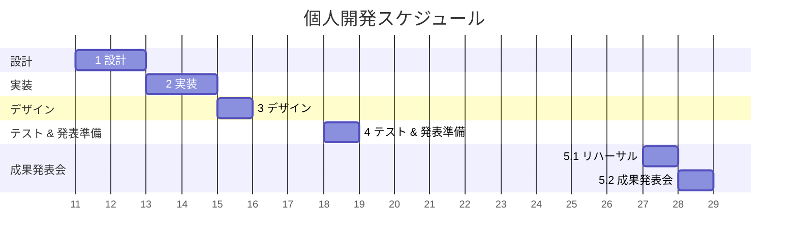
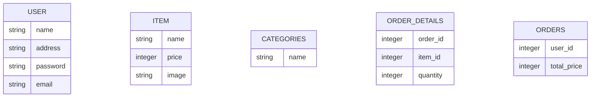
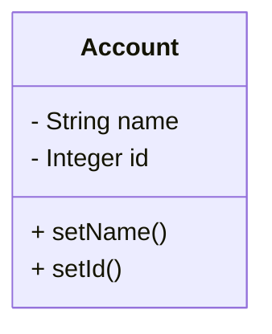

## 個人開発　小林（fグループ）

**開発システムテーマ：** 買い物したくなるショッピングサイト  
**開発システム名：** ゲームショッピングサイト 
**プロジェクトメンバー：** 長岡、末久、浜崎、小林

**GitHubリポジトリ**  
長岡：https://github.com/2026-reskill-tech-tbc/personal_dev_13292tnagaoka.git  
末久：https://github.com/2026-reskill-tech-tbc/personal_dev_13285ssuehisa.git  
浜崎：https://github.com/2026-reskill-tech-tbc/personal_dev_13284khamasaki.git  
小林：https://github.com/2026-reskill-tech-tbc/personal_dev_13278dkobayashi.git  

---

## 個人開発スケジュール

| WBS ID | タスク名 | 担当者 | 開始日 | 終了日 | 工数(人日) |
|--------|---------|-------|--------|-------|------------|
| 1 | 設計     | Xグループ   | 5/11 | 5/12 | 1.5 |
| 2 | 実装     | Xグループ   | 5/13 | 5/14 | 2 |
| 3 | デザイン | Xグループ   | 5/15 | 5/15 | 1 |
| 4 | テスト（1日必ず実施する）＆発表準備 | Xグループ   | 5/18 | 5/18 | 1 |
| 5.1 | 成果発表会リハーサル | Xグループ   | 5/27 | 5/27 | 1 |
| 5.2 | 成果発表会 | Xグループ   | 5/28 | 5/28 | 1 |

## ER図（サンプル）

---
## クラス図 - SessionScope（サンプル）

